# Oi, eu sou o José

**Desenvolvedor Back-end · Sistemas de Informação — PUC/PR**

---

Comecei pelo back-end e hoje trabalho com clientes reais pela **No Fear**, startup que ajudei a montar. Entre os projetos está o MVP de um software de gestão para clínicas odontológicas.

---

## Stacks

**Back-end** — Python, FastAPI, SQLAlchemy, Alembic, Java

**Front-end** — HTML, CSS, JavaScript

**Dados** — PostgreSQL, MySQL, pandas, Matplotlib (pyplot)

**Ferramentas** — Git, GitHub, VS Code

---

## Estatísticas

---

## Contato

